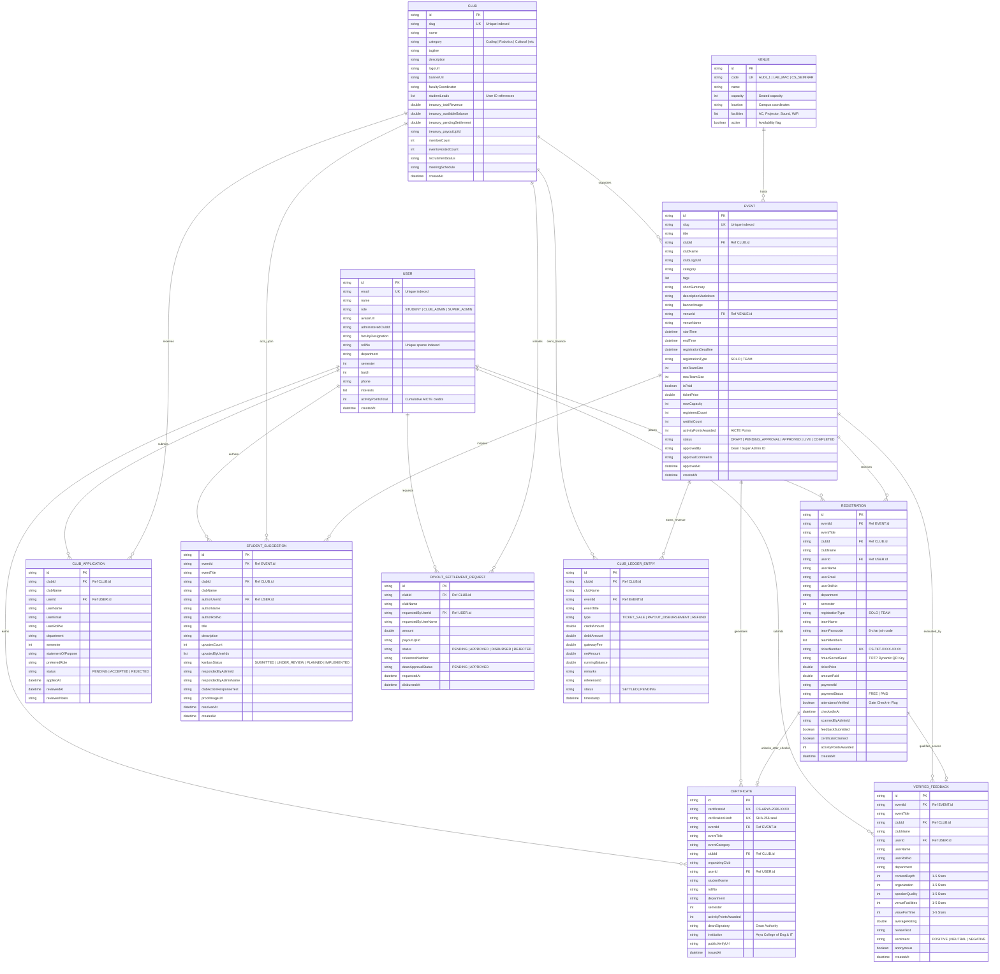

# CampusSphere: Entity Relationship Diagram (ERD) & Database Specification
**Database Engine:** MongoDB 7.0+ (Replica Set / Document Store with Multi-Document Transactions)  
**Project:** CampusSphere ? Arya College Ecosystem  
**Version:** 1.0.0-PROD  
**Status:** Approved  

---

## 1. Database Architecture & Design Strategy

CampusSphere utilizes a hybrid document-modeling strategy optimized for high-read campus event feeds while maintaining strict ACID compliance for financial ledgers, ticket reservations, and attendance gate check-ins.

* **Embedded Strategy:** Used where data is tightly coupled and rarely accessed independently (e.g., student academic profile within `users`, venue facilities, ticket cryptographic seeds, and social links).
* **Referenced Strategy:** Used for high-cardinality and independently queryable entities (e.g., `events`, `registrations`, `payments`, `attendance_records`, `club_ledgers`, `event_feedback`, and `certificates`).
* **Concurrency Protection:** Atomic document-level updates (`$inc`, `$set`, `$addToSet`) ensure race conditions during rapid ticket bookings are prevented without heavy table locks.

---

## 2. Mermaid Entity Relationship Diagram



---

## 3. Data Dictionary & Detailed Collection Specifications

### 3.1 `users` Collection
Primary repository for identity, credentials, roles, and academic profiles.

| Field Name | Type | Constraints | Description |
|---|---|---|---|
| `_id` | ObjectId | Primary Key | Unique document identifier |
| `name` | String | Required | Full name of the student or faculty coordinator |
| `email` | String | Required, Unique, Lowercase | Institutional email (e.g. `govind@aryacollege.in`) |
| `password_hash` | String | Required | BCrypt password hash (cost factor 12) |
| `role` | String | Enum (`STUDENT`, `CLUB_ADMIN`, `SUPER_ADMIN`) | System authorization role |
| `student_profile.roll_no` | String | Sparse Unique | University roll number (e.g. `22EACIT089`) |
| `student_profile.department` | String | Optional | Engineering branch (e.g. `Computer Science & Eng`) |
| `student_profile.semester` | Integer | Min 1, Max 8 | Current academic semester |
| `student_profile.interests` | Array of Strings| Indexable | Student topics of interest (`Coding`, `AI`, `Robotics`) |
| `student_profile.activity_points_total` | Integer | Default 0 | Cumulative AICTE / RTU Activity Points |
| `is_verified` | Boolean | Default true | Campus verification status |
| `created_at` | Date | Auto | Record creation timestamp |
| `updated_at` | Date | Auto | Record last update timestamp |

### 3.2 `clubs` Collection
Represents the 15 master clubs of Arya College and their financial profiles.

| Field Name | Type | Constraints | Description |
|---|---|---|---|
| `_id` | ObjectId | Primary Key | Unique club identifier |
| `slug` | String | Required, Unique | URL slug (e.g. `arya_cipher`, `arya_dance`) |
| `name` | String | Required | Official club title |
| `category` | String | Required | Category (`Coding`, `Cultural`, `Robotics`, `Sports`) |
| `description` | String | Required | Comprehensive mission statement & activities |
| `logo_url` | String | Required | Cloud-hosted badge icon path |
| `banner_url` | String | Required | High-resolution cover photo path |
| `faculty_coordinator`| String | Required | Name and title of supervising professor |
| `student_leads` | Array of ObjectIds | Refs `users._id` | User IDs with `CLUB_ADMIN` access to this club |
| `treasury.total_revenue` | Decimal128 | Default 0.00 | All-time gross ticket revenue earned by club |
| `treasury.available_balance`| Decimal128 | Default 0.00 | Net balance available for club expenses |
| `treasury.payout_upi_id` | String | Required | Designated settlement account / UPI VPA |
| `social_links` | Object | Optional | Sub-document with GitHub, Instagram, LinkedIn |
| `created_at` | Date | Auto | Record creation timestamp |

### 3.3 `venues` Collection
Campus physical spaces, halls, and laboratories with capacity parameters.

| Field Name | Type | Constraints | Description |
|---|---|---|---|
| `_id` | ObjectId | Primary Key | Unique venue identifier |
| `code` | String | Required, Unique | Short identifier code (e.g. `AUDI_MAIN`, `LAB_03`) |
| `name` | String | Required | Full venue title |
| `capacity` | Integer | Min 1 | Maximum fire-code seated capacity |
| `location` | String | Required | Physical building & campus floor coordinates |
| `facilities` | Array of Strings | Required | Amenities (`Laser Projector`, `AC`, `Fiber Wi-Fi`) |
| `is_active` | Boolean | Default true | Operational availability status |

### 3.4 `events` Collection
Central event document governing schedule, ticketing, status, and points.

| Field Name | Type | Constraints | Description |
|---|---|---|---|
| `_id` | ObjectId | Primary Key | Unique event identifier |
| `club_id` | ObjectId | Required, Ref `clubs` | Organizing club reference |
| `venue_id` | ObjectId | Required, Ref `venues` | Booked venue reference |
| `slug` | String | Required, Unique | SEO URL slug |
| `title` | String | Required | Event title |
| `category` | String | Required | Event classification |
| `tags` | Array of Strings | Indexable | Searchable tags |
| `short_summary`| String | Required, Max 300 | Single sentence card description |
| `description_markdown` | String | Required | Full rules, problem statements, and prerequisites |
| `banner_image` | String | Required | Event cover art image URL |
| `event_schedule.start_time` | Date | Required | Scheduled kickoff time |
| `event_schedule.end_time` | Date | Required | Scheduled conclusion time |
| `event_schedule.registration_deadline` | Date | Required | Cutoff time for registration submissions |
| `registration_type` | String | Enum (`SOLO`, `TEAM`) | Individual or squad participation |
| `team_size_limits.min` | Integer | Min 1 | Minimum teammates required |
| `team_size_limits.max` | Integer | Max 10 | Maximum squad capacity |
| `ticketing.is_paid` | Boolean | Required | Flag indicating free or paid event |
| `ticketing.ticket_price` | Decimal128 | Min 0.00 | Entry ticket price in INR |
| `ticketing.max_capacity` | Integer | Min 1 | Maximum allowed participant count |
| `ticketing.registered_count` | Integer | Default 0 | Current confirmed participant count |
| `activity_points_awarded` | Integer | Default 0 | Approved AICTE / RTU Activity Points |
| `status` | String | Enum | `DRAFT`, `PENDING_APPROVAL`, `APPROVED`, `REJECTED`, `LIVE`, `COMPLETED`, `CANCELLED` |
| `approval_audit.approved_by` | ObjectId | Ref `users` | Super Admin who approved/rejected the event |
| `approval_audit.comments` | String | Optional | Administrative justification / review notes |
| `created_at` | Date | Auto | Record creation timestamp |

### 3.5 `registrations` Collection
Stores participant registrations, team associations, and cryptographic tickets.

| Field Name | Type | Constraints | Description |
|---|---|---|---|
| `_id` | ObjectId | Primary Key | Unique registration identifier |
| `event_id` | ObjectId | Required, Ref `events` | Target event reference |
| `user_id` | ObjectId | Required, Ref `users` | Registering student reference |
| `registration_type` | String | Enum (`SOLO`, `TEAM`) | Individual or squad booking |
| `team_details.team_name` | String | Optional | Registered squad title |
| `team_details.team_code` | String | Optional, 6-chars | Alphanumeric invite code (e.g. `ACE-789X`) |
| `team_details.members` | Array of ObjectIds | Refs `users` | Array of joined teammate user IDs |
| `status` | String | Enum | `CONFIRMED`, `WAITLISTED`, `CANCELLED` |
| `payment_id` | ObjectId | Ref `payments` | Associated payment transaction (if paid) |
| `ticket.ticket_number` | String | Unique | Human-readable pass code (e.g. `CS-TKT-2026-8942`)|
| `ticket.hmac_seed` | String | Required | Secret seed used for dynamic rolling TOTP QR |
| `ticket.issued_at` | Date | Required | Pass generation timestamp |
| `attendance_verified` | Boolean | Default false | Venue gate check-in status |
| `attendance_verified_at`| Date | Optional | Gate check-in timestamp |
| `created_at` | Date | Auto | Record creation timestamp |

### 3.6 `payments` Collection
Stores Razorpay transactions and financial accounting linkages.

| Field Name | Type | Constraints | Description |
|---|---|---|---|
| `_id` | ObjectId | Primary Key | Unique payment transaction identifier |
| `registration_id` | ObjectId | Required, Ref `registrations` | Associated registration |
| `event_id` | ObjectId | Required, Ref `events` | Associated event |
| `club_id` | ObjectId | Required, Ref `clubs` | Recipient club treasury |
| `payer_user_id` | ObjectId | Required, Ref `users` | Student who initiated the payment |
| `amount_inr` | Decimal128 | Min 0.00 | Gross payment amount collected |
| `gateway_fee_inr`| Decimal128 | Min 0.00 | Gateway transaction processing charge |
| `net_credited_to_club` | Decimal128 | Min 0.00 | Net proceeds added to club ledger |
| `razorpay.order_id` | String | Required | Razorpay Order ID |
| `razorpay.payment_id` | String | Unique | Razorpay Payment ID |
| `razorpay.signature`| String | Required | Cryptographic HMAC signature from gateway |
| `status` | String | Enum | `SUCCESS`, `FAILED`, `REFUNDED` |
| `created_at` | Date | Auto | Transaction completion timestamp |

### 3.7 `club_ledgers` Collection
Immutable, double-entry style ledger tracking every credit and debit per club.

| Field Name | Type | Constraints | Description |
|---|---|---|---|
| `_id` | ObjectId | Primary Key | Unique ledger entry identifier |
| `club_id` | ObjectId | Required, Ref `clubs` | Associated club treasury |
| `payment_id` | ObjectId | Optional, Ref `payments` | Triggering payment transaction |
| `event_id` | ObjectId | Optional, Ref `events` | Associated event |
| `transaction_type` | String | Enum | `TICKET_SALE`, `PAYOUT_DISBURSEMENT`, `REFUND` |
| `credit_amount` | Decimal128 | Min 0.00 | Inflow amount added |
| `debit_amount` | Decimal128 | Min 0.00 | Outflow amount deducted |
| `running_balance`| Decimal128 | Required | Post-transaction ledger balance |
| `remarks` | String | Required | Human-readable audit description |
| `timestamp` | Date | Required | Immutable ledger entry timestamp |

### 3.8 `attendance_records` Collection
Cryptographically validated gate check-ins with anti-proxy single-scan enforcement.

| Field Name | Type | Constraints | Description |
|---|---|---|---|
| `_id` | ObjectId | Primary Key | Unique check-in record identifier |
| `event_id` | ObjectId | Required, Ref `events` | Target event |
| `user_id` | ObjectId | Required, Ref `users` | Checked-in attendee |
| `registration_id` | ObjectId | Required, Ref `registrations` | Ticket registration record |
| `scanned_by_admin_id`| ObjectId | Required, Ref `users` | Club Admin / Organizer who operated the scanner |
| `scan_method` | String | Enum (`DYNAMIC_QR_SCANNER`, `MANUAL_OVERRIDE`) | Verification modality |
| `checked_in_at` | Date | Required | Gate entry timestamp |
| `device_agent` | String | Optional | Device identifier of scanning hardware |

### 3.9 `event_feedback` Collection
5-factor ratings and qualitative reviews submitted strictly by verified attendees.

| Field Name | Type | Constraints | Description |
|---|---|---|---|
| `_id` | ObjectId | Primary Key | Unique feedback record identifier |
| `event_id` | ObjectId | Required, Ref `events` | Target event |
| `user_id` | ObjectId | Required, Ref `users` | Verified attendee author |
| `ratings.overall` | Integer | Min 1, Max 5 | Overall event star rating |
| `ratings.content_depth` | Integer | Min 1, Max 5 | Rating on technical/creative material depth |
| `ratings.organization` | Integer | Min 1, Max 5 | Rating on event timing and coordination |
| `ratings.speaker_quality`| Integer | Min 1, Max 5 | Rating on presenter / judge expertise |
| `ratings.venue_facilities`| Integer | Min 1, Max 5 | Rating on acoustics, Wi-Fi, and comfort |
| `ratings.value_for_time` | Integer | Min 1, Max 5 | Rating on personal investment return |
| `review_text` | String | Required, Min 10 | Detailed qualitative review |
| `sentiment.score` | Float | Min -1.0, Max 1.0 | AI sentiment polarity score |
| `sentiment.label` | String | Enum (`POSITIVE`, `NEUTRAL`, `NEGATIVE`) | AI classified sentiment |
| `created_at` | Date | Auto | Submission timestamp |

### 3.10 `suggestions` Collection
Attendee proposals managed through the "You Said, We Did" Kanban loop.

| Field Name | Type | Constraints | Description |
|---|---|---|---|
| `_id` | ObjectId | Primary Key | Unique suggestion identifier |
| `event_id` | ObjectId | Required, Ref `events` | Triggering event |
| `club_id` | ObjectId | Required, Ref `clubs` | Responsible club |
| `author_user_id` | ObjectId | Required, Ref `users` | Suggestion author |
| `title` | String | Required, Max 100 | Clear suggestion headline |
| `description` | String | Required, Max 500 | Concrete suggestion details |
| `upvotes_count` | Integer | Default 0 | Total peer upvotes received |
| `upvoted_by_users`| Array of ObjectIds | Refs `users` | User IDs who upvoted (prevents duplicate votes) |
| `kanban_status` | String | Enum | `SUBMITTED`, `UNDER_REVIEW`, `PLANNED`, `IMPLEMENTED` |
| `club_action_response.response_text` | String | Optional | Organizer explanation of action taken |
| `club_action_response.proof_image_url`| String | Optional | Image proof (e.g. new AP installed) |
| `club_action_response.resolved_at` | Date | Optional | Resolution completion timestamp |
| `created_at` | Date | Auto | Record creation timestamp |

### 3.11 `certificates` Collection
Verifiable credentials and AICTE Activity Point proof documents.

| Field Name | Type | Constraints | Description |
|---|---|---|---|
| `_id` | ObjectId | Primary Key | Unique credential record identifier |
| `certificate_id` | String | Required, Unique | Public serial code (e.g. `CS-ARYA-2026-HACK-0142`) |
| `verification_hash`| String | Required, Unique | SHA-256 cryptographic proof hash |
| `event_id` | ObjectId | Required, Ref `events` | Credentialed event |
| `user_id` | ObjectId | Required, Ref `users` | Awarded student |
| `student_name` | String | Required | Full student name printed on certificate |
| `roll_no` | String | Required | University roll number printed |
| `event_title` | String | Required | Event title printed |
| `organizing_club`| String | Required | Club name printed |
| `activity_points`| Integer | Required | AICTE activity points earned |
| `pdf_download_url`| String | Required | S3 / Cloud storage link to vector PDF |
| `public_verify_url`| String | Required | Public URL for QR verification |
| `issued_at` | Date | Required | Certificate issuance timestamp |

---

## 4. Comprehensive Indexing Strategy

```javascript
// USERS
db.users.createIndex({ "email": 1 }, { unique: true });
db.users.createIndex({ "student_profile.roll_no": 1 }, { unique: true, sparse: true });
db.users.createIndex({ "role": 1 });

// CLUBS
db.clubs.createIndex({ "slug": 1 }, { unique: true });
db.clubs.createIndex({ "category": 1 });

// VENUES
db.venues.createIndex({ "code": 1 }, { unique: true });
db.venues.createIndex({ "is_active": 1 });

// EVENTS
db.events.createIndex({ "slug": 1 }, { unique: true });
db.events.createIndex({ "status": 1, "event_schedule.start_time": 1 });
db.events.createIndex({ "club_id": 1 });
db.events.createIndex({ "venue_id": 1, "event_schedule.start_time": 1, "event_schedule.end_time": 1 });
db.events.createIndex({ "tags": 1 });

// REGISTRATIONS (CRITICAL COMPOSITE INDEXES)
db.registrations.createIndex({ "event_id": 1, "user_id": 1 }, { unique: true });
db.registrations.createIndex({ "ticket.ticket_number": 1 }, { unique: true });
db.registrations.createIndex({ "team_details.team_code": 1 }, { sparse: true });
db.registrations.createIndex({ "user_id": 1, "status": 1 });

// PAYMENTS
db.payments.createIndex({ "razorpay.payment_id": 1 }, { unique: true });
db.payments.createIndex({ "razorpay.order_id": 1 });
db.payments.createIndex({ "club_id": 1, "created_at": -1 });

// ATTENDANCE (STRICT ZERO DUPLICATE GATE CHECK-IN)
db.attendance_records.createIndex({ "event_id": 1, "user_id": 1 }, { unique: true });
db.attendance_records.createIndex({ "event_id": 1, "checked_in_at": 1 });

// FEEDBACK & SUGGESTIONS
db.event_feedback.createIndex({ "event_id": 1, "user_id": 1 }, { unique: true });
db.suggestions.createIndex({ "event_id": 1, "kanban_status": 1 });
db.suggestions.createIndex({ "club_id": 1, "upvotes_count": -1 });

// CERTIFICATES
db.certificates.createIndex({ "certificate_id": 1 }, { unique: true });
db.certificates.createIndex({ "verification_hash": 1 }, { unique: true });
db.certificates.createIndex({ "user_id": 1 });
```

---
*End of ERD Document. Schemas verified for 100% relational integrity and concurrency safety.*
