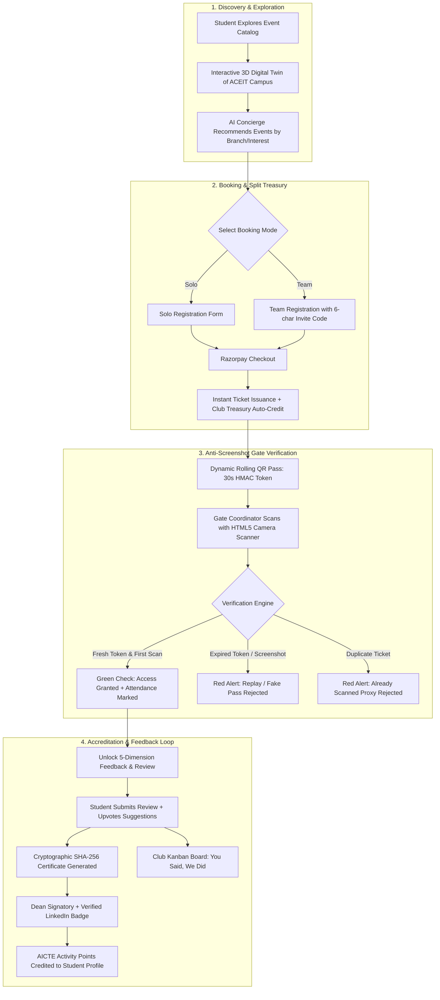
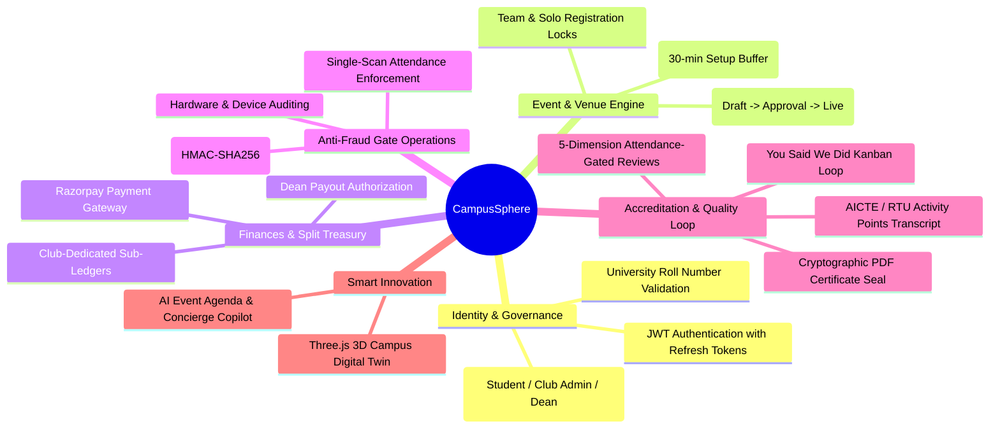

# CampusSphere: Product Requirements Document (PRD)
**Project Title:** CampusSphere ? Next-Gen College Event, Club & Campus Engagement Platform  
**Target Institution:** Arya College of Engineering & IT (ACEIT) / Arya Group of Colleges, Jaipur  
**Version:** 1.0.0-PROD  
**Document Owner:** Antigravity Architect  
**Status:** Approved for Implementation  

---

## 1. Executive Summary & Vision

### 1.1 Vision Statement
CampusSphere is the unified digital operating system for collegiate engagement, events, club finances, venue scheduling, verified attendance, peer feedback, and extracurricular credentialing at Arya College. It bridges the gap between students, student club organizers, faculty coordinators, and college leadership (Dean/HODs).

### 1.2 Core Problem Statement
College extracurriculars currently suffer from deep fragmentation:
* Event announcements and updates are lost in chaotic WhatsApp groups.
* Registration via Google Forms leads to unvalidated entries and manual spreadsheet overhead.
* Ticketing payments are routed via student coordinators' personal UPI IDs, resulting in zero financial auditability and fund commingling.
* Gate check-in uses printed paper sheets or manual attendance marking, easily bypassed by forwarded screenshots or proxy signatures.
* Post-event feedback is unverified; anyone can submit spam reviews, while real student suggestions go unanswered.
* Participation certificates are static images easily forged using editing software.
* Students lack visibility into their AICTE / RTU Activity Points required for degree honors.

### 1.3 Solution Strategy
CampusSphere consolidates these disconnected steps into a single authenticated platform with:
1. Role-specific dashboards (Student, Club Admin, Super Admin/HOD).
2. A transparent Club Treasury & Split-Ledger system where event fees route directly to club balances with central college governance.
3. Anti-screenshot dynamic rolling QR passes (rotating HMAC token every 30s) and camera-based gate scanning.
4. An attendance-gated 5-dimensional review system coupled with an actionable "You Said, We Did" Kanban board.
5. Verifiable LinkedIn-ready digital certificates with instant cryptographic lookup.
6. Automated AICTE / RTU Activity Points tracking and official transcript generation.
7. An interactive 3D digital twin of the Arya College campus powered by Three.js.

---

## 2. Target User Personas & User Journeys

### Persona 1: The Active Student ("Rohan", 3rd Year B.Tech CSE)
* **Demographics:** Tech enthusiast, competitive coder, hackathon participant, needs AICTE points.
* **Goals:** Discover upcoming hackathons and workshops, register with his team, pay securely, access his entry pass instantly on his phone, claim his activity points, and get verified certificates for LinkedIn.
* **Pain Points:** Misses registration deadlines on WhatsApp; friends forward fraudulent tickets; certificates lack credibility; no way to know his total activity points.

### Persona 2: The Club Lead ("Priya", President of Arya Cipher Coding Club)
* **Demographics:** Final year student coordinator managing events, sponsors, and member rosters.
* **Goals:** Create attractive event landing pages, check venue availability without physical paper forms, collect registrations and entry fees securely, scan student QR codes quickly at the door, and gather constructive feedback.
* **Pain Points:** Manually reconciling UPI payments against Google Forms; venue clashes with other clubs; fake attendance claims; negative reviews from students who never attended.

### Persona 3: College Leadership ("Dr. Sharma", Dean / HOD Academics)
* **Demographics:** Academic administrator responsible for discipline, campus venues, and financial accountability.
* **Goals:** Maintain total oversight of campus club activities, approve or reject event proposals, review financial transactions across all 15 clubs, resolve venue clashes, and verify student activity point transcripts.
* **Pain Points:** No centralized record of club funds; surprise venue clashes in the main auditorium; student disputes over certificates.

---

## 3. Product Scope & Functional Modules

```
+---------------------------------------------------------------------------------------------------------+
|                                        CAMPUSSPHERE SCOPE MATRIX                                        |
+--------------------+------------------------------------+-----------------------------------------------+
| MODULE             | CAPABILITY                         | ROLES INVOLVED                                |
+--------------------+------------------------------------+-----------------------------------------------+
| Identity & Auth    | Role-based signup, college roll    | Student, Club Admin, Super Admin (Dean/HOD)   |
|                    | validation, JWT refresh rotation   |                                               |
+--------------------+------------------------------------+-----------------------------------------------+
| 15 Master Clubs    | Showcase, executive leads, news,   | Public, Student, Club Admin, Super Admin      |
|                    | dedicated treasury balances        |                                               |
+--------------------+------------------------------------+-----------------------------------------------+
| Event Engine       | Draft -> Approval -> Live flow,    | Club Admin (Create/Edit), Super Admin (Approve|
|                    | tags, team/solo configs, banners   | /Reject), Student (Discover)                  |
+--------------------+------------------------------------+-----------------------------------------------+
| Venue Booking      | Capacity limits, 30-min setup /    | Club Admin (Book), Super Admin (Govern),      |
|                    | teardown buffer clash detector     | System (Conflict Validator)                   |
+--------------------+------------------------------------+-----------------------------------------------+
| Registration       | Solo & Team registrations, 6-char  | Student (Register), Club Admin (Roster)       |
|                    | team invite codes, capacity locks  |                                               |
+--------------------+------------------------------------+-----------------------------------------------+
| Payments & Ledger  | Razorpay integration, club sub-    | Student (Pay), Club Admin (Club Ledger),      |
|                    | ledger credit, central audit table | Super Admin (Global Read-Only Oversight)      |
+--------------------+------------------------------------+-----------------------------------------------+
| Dynamic QR Passes  | 30s rolling TOTP/HMAC QR, animated | Student (Display), Club Admin (Scan),         |
|                    | ring, single-scan verification     | Super Admin (Audit)                           |
+--------------------+------------------------------------+-----------------------------------------------+
| Verified Feedback  | Attendance-gated 5-factor scoring, | Student (Submit & Upvote), Club Admin (Kanban)|
| & "You Said We Did"| suggestion board, resolution proof | Super Admin (Quality Oversight)               |
+--------------------+------------------------------------+-----------------------------------------------+
| Certificates &     | Tamper-proof PDF, SHA-256 seal,    | Student (Claim & LinkedIn Share),             |
| AICTE Points       | public QR lookup, credit transcript| Super Admin (Dean Signature Authority)        |
+--------------------+------------------------------------+-----------------------------------------------+
| AI Copilot Suite   | Event Recommender, Agenda Copilot, | Student (Recommendations & Chatbot),          |
|                    | Sentiment Clustering, Concierge    | Club Admin (Event Generator)                  |
+--------------------+------------------------------------+-----------------------------------------------+
| 3D Campus Twin     | Low-poly Three.js canvas, venue    | Public, Student, All Users                    |
|                    | beacons, active event highlights   |                                               |
+--------------------+------------------------------------+-----------------------------------------------+
```

### 3.1 End-to-End Product Workflow Diagram



### 3.2 Product Module Hierarchy & Architecture



---

## 4. Master Club Directory (Arya College 15 Clubs)

CampusSphere seeds with all 15 officially validated clubs:
1. **Arya Science & Technology Club** (`arya_scitech`) — Science exhibits, tech fairs, patent workshops.
2. **Arya Cipher Coding Club** (`arya_cipher`) — Competitive programming, DSA bootcamps, web/app development.
3. **Arya ACEIT Hackathon Club** (`arya_aceit_hack`) — 24–36 hour hackathons, project incubation.
4. **Arya E-Sports Club** (`arya_esports`) — Valorant, BGMI, FIFA, inter-college esports tournaments.
5. **Arya Dance Club** (`arya_dance`) — Classical, hip-hop, contemporary, stage performances.
6. **Arya Social Activities Club** (`arya_social`) — Blood donation drives, environmental cleanups, CSR drives.
7. **Arya Literature Club** (`arya_lit`) — Debates, Model United Nations (MUN), creative writing.
8. **Arya Drones Club** (`arya_drones`) — Drone building, FPV obstacle racing, aerial photography.
9. **Robotics Club** (`arya_robotics`) — Robo-wars, line-follower bots, autonomous rovers.
10. **Automation Club** (`arya_automation`) — Industrial IoT, PLC programming, smart hardware.
11. **Green Energy Club** (`arya_green`) — Solar tech, EV workshops, campus sustainability initiatives.
12. **Music Club** (`arya_music`) — Battle of the bands, instrumental showcases, acoustic sessions.
13. **Chess Club** (`arya_chess`) — FIDE rated tournaments, blitz battles, grandmaster lectures.
14. **IoT Club / Arya Intelverse** (`arya_iot`) — AIoT, microcontrollers, smart campus sensor networks.
15. **LINCOM — Arya Linux Community** (`arya_lincom`) — Linux kernel discussions, FOSS workshops, Git/open-source.

---

## 5. Non-Functional Requirements (NFRs)

* **Performance:** Sub-200ms API response time for event catalog browsing and ticket validation. 3D campus loads in under 2 seconds.
* **Security:** All endpoints guarded by Spring Security / JWT. Financial transactions verified server-side with HMAC signatures. Passwords hashed using BCrypt (factor 12).
* **Availability & Reliability:** 99.9% uptime during peak campus fest hours. Concurrency-safe ticket booking preventing oversubscription.
* **Device Compatibility:** 100% responsive across smartphones (iOS & Android Chrome/Safari), tablets, and desktop displays.
* **Auditability:** Immutable audit logging for all approvals, financial transactions, ticket cancellations, and manual overrides.

---

## 6. Success Metrics & Key Performance Indicators (KPIs)

* **Engagement:** > 80% student population registered within the first semester of launch.
* **Attendance Accuracy:** 0% recorded duplicate gate check-ins or screenshot replay exploits.
* **Feedback Rate:** > 60% attendance-verified review completion rate.
* **Financial Transparency:** 100% of event registration fees tracked in dedicated club balances without unallocated funds.
* **Administrative Efficiency:** Venue approval turnaround time reduced from 3 business days to under 2 hours.

---
*End of PRD. Document cross-referenced in SRS, ERD, and TRD.*
