# CampusSphere: System Design & UML Specifications

**Project Title:** CampusSphere — Next-Gen College Event, Club & Campus Engagement Platform  
**Target Institution:** Arya College of Engineering & IT (ACEIT), Jaipur  
**Version:** 1.0.0-PROD  
**Document Type:** Software Architecture & UML Design Document  
**Status:** Approved & Verified Locally  

---

## Table of Contents
1. [Executive Architecture Overview](#1-executive-architecture-overview)
2. [High-Level System Architecture Diagram](#2-high-level-system-architecture-diagram)
3. [UML Use-Case Diagrams](#3-uml-use-case-diagrams)
   - [3.1 Master System Use-Case Diagram](#31-master-system-use-case-diagram)
   - [3.2 Student Actor Flow](#32-student-actor-flow)
   - [3.3 Club Admin Actor Flow](#33-club-admin-actor-flow)
   - [3.4 Super Admin (Dean / Leadership) Flow](#34-super-admin-dean--leadership-flow)
   - [3.5 Use Case Detailed Specifications](#35-use-case-detailed-specifications)
4. [UML Class Diagram](#4-uml-class-diagram)
   - [4.1 Backend Domain Model Hierarchy](#41-backend-domain-model-hierarchy)
   - [4.2 Service & Controller Architecture](#42-service--controller-architecture)
5. [Entity Relationship Diagram (ERD)](#5-entity-relationship-diagram-erd)
   - [5.1 Complete 11-Collection MongoDB Schema](#51-complete-11-collection-mongodb-schema)
   - [5.2 Cardinality & Relationship Matrix](#52-cardinality--relationship-matrix)
6. [Behavioral & Sequence Diagrams](#6-behavioral--sequence-diagrams)
   - [6.1 Event Creation & Super Admin Approval Flow](#61-event-creation--super-admin-approval-flow)
   - [6.2 Registration, Team Invite & Payment Settlement Flow](#62-registration-team-invite--payment-settlement-flow)
   - [6.3 30-Second Rolling HMAC Dynamic QR Gate Verification](#63-30-second-rolling-hmac-dynamic-qr-gate-verification)
   - [6.4 Attendance-Gated Feedback & AICTE Certificate Issuance](#64-attendance-gated-feedback--aicte-certificate-issuance)
   - [6.5 Venue Clash Detection & Buffer Resolution](#65-venue-clash-detection--buffer-resolution)
7. [State Machine Diagrams](#7-state-machine-diagrams)
   - [7.1 Event Lifecycle State Machine](#71-event-lifecycle-state-machine)
   - [7.2 Registration & Attendance Lifecycle](#72-registration--attendance-lifecycle)
   - [7.3 "You Said, We Did" Kanban Workflow](#73-you-said-we-did-kanban-workflow)
8. [Data Flow Diagrams (DFD)](#8-data-flow-diagrams-dfd)

---

## 1. Executive Architecture Overview

CampusSphere is architected using a modern decoupled client-server architecture:
* **Frontend Client:** React 19 (TypeScript, Vite, Tailwind CSS, Lucide Icons, Three.js 3D Campus Digital Twin).
* **Backend Application Server:** Spring Boot 3.x (Java 21, Spring Data MongoDB, Spring Web, Spring Security with JWT & BCrypt, Lombok).
* **Primary Database:** MongoDB 7.0+ Replica Set utilizing document-level atomicity and multi-document ACID transactions for financial and capacity updates.
* **External Integrations:** Razorpay Payment Gateway, Cloudinary CDN for multimedia assets, Google Gemini AI for smart agendas and recommendations.

---

## 2. High-Level System Architecture Diagram

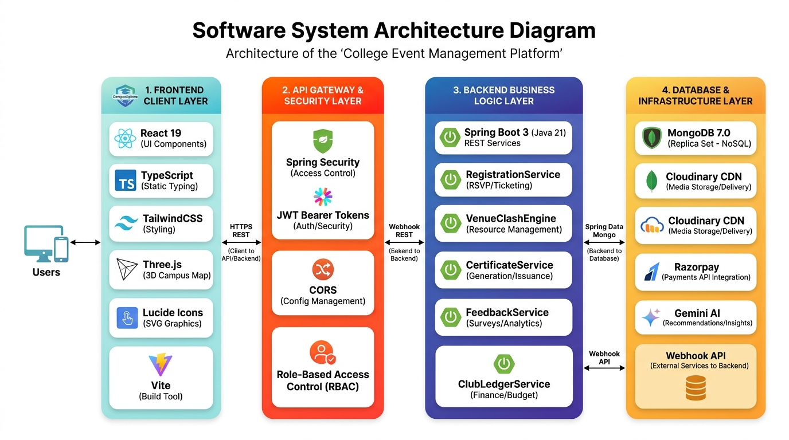

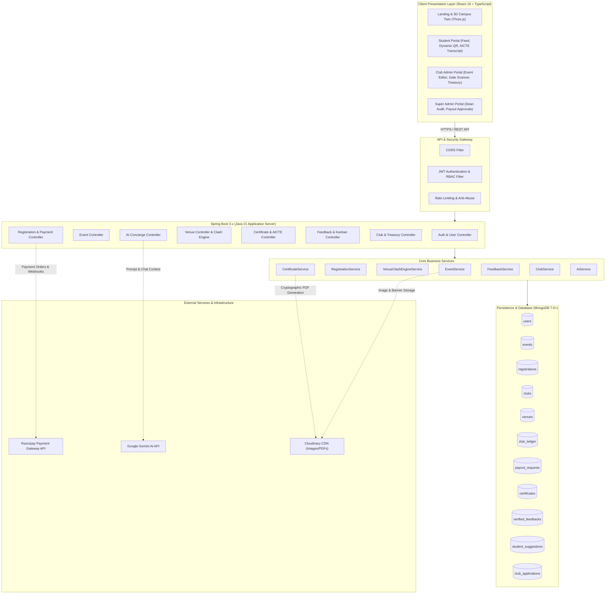
```mermaid
graph TB
    subgraph Client_Layer ["Client Presentation Layer (React 19 + TypeScript)"]
        UI_Home["Landing & 3D Campus Twin (Three.js)"]
        UI_Student["Student Portal (Feed, Dynamic QR, AICTE Transcript)"]
        UI_Admin["Club Admin Portal (Event Editor, Gate Scanner, Treasury)"]
        UI_SuperAdmin["Super Admin Portal (Dean Audit, Payout Approvals)"]
    end

    subgraph Gateway_Layer ["API & Security Gateway"]
        CORS["CORS Filter"]
        JWT_Filter["JWT Authentication & RBAC Filter"]
        RateLimiter["Rate Limiting & Anti-Abuse"]
    end

    subgraph Server_Layer ["Spring Boot 3.x (Java 21 Application Server)"]
        Ctrl_Auth["Auth & User Controller"]
        Ctrl_Event["Event Controller"]
        Ctrl_Reg["Registration & Payment Controller"]
        Ctrl_Venue["Venue Controller & Clash Engine"]
        Ctrl_Cert["Certificate & AICTE Controller"]
        Ctrl_Feed["Feedback & Kanban Controller"]
        Ctrl_Club["Club & Treasury Controller"]
        Ctrl_AI["AI Concierge Controller"]
    end

    subgraph Service_Layer ["Core Business Services"]
        Svc_Event["EventService"]
        Svc_Reg["RegistrationService"]
        Svc_Venue["VenueClashEngineService"]
        Svc_Cert["CertificateService"]
        Svc_Feedback["FeedbackService"]
        Svc_Club["ClubService"]
        Svc_AI["AiService"]
    end

    subgraph Persistence_Layer ["Persistence & Database (MongoDB 7.0+)"]
        DB_Users[("users")]
        DB_Events[("events")]
        DB_Regs[("registrations")]
        DB_Clubs[("clubs")]
        DB_Venues[("venues")]
        DB_Ledger[("club_ledger")]
        DB_Payouts[("payout_requests")]
        DB_Certs[("certificates")]
        DB_Feedback[("verified_feedbacks")]
        DB_Suggestions[("student_suggestions")]
        DB_Apps[("club_applications")]
    end

    subgraph External_Services ["External Services & Infrastructure"]
        Ext_Razorpay["Razorpay Payment Gateway API"]
        Ext_Gemini["Google Gemini AI API"]
        Ext_Cloudinary["Cloudinary CDN (Images/PDFs)"]
    end

    Client_Layer -->|HTTPS / REST API| Gateway_Layer
    Gateway_Layer --> Server_Layer
    Server_Layer --> Service_Layer
    Service_Layer --> Persistence_Layer

    Ctrl_Reg -.->|Payment Orders & Webhooks| Ext_Razorpay
    Ctrl_AI -.->|Prompt & Chat Context| Ext_Gemini
    Svc_Event -.->|Image & Banner Storage| Ext_Cloudinary
    Svc_Cert -.->|Cryptographic PDF Generation| Ext_Cloudinary
```

---

## 3. UML Use-Case Diagrams

### 3.1 Master System Use-Case Diagram

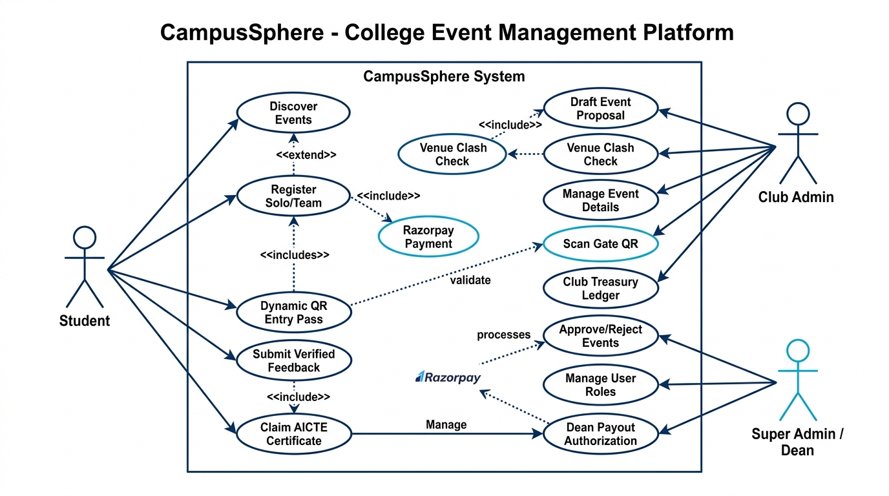

```mermaid
flowchart TD
    %% Actors
    Student((fa:fa-user Student))
    ClubAdmin((fa:fa-user-tie Club Admin))
    Dean((fa:fa-user-shield Super Admin / Dean))
    AICo((fa:fa-robot AI Concierge))

    subgraph CampusSphere_System ["CampusSphere Platform"]
        %% Student Use Cases
        UC1([Discover & Filter Events])
        UC2([Explore 3D Campus Twin])
        UC3([Register Solo or Team])
        UC4([Pay via Razorpay Gateway])
        UC5([Display 30s Dynamic Rolling QR Ticket])
        UC6([Submit Attendance-Verified Review])
        UC7([Upvote & Submit Suggestions])
        UC8([Claim Digital Certificate & AICTE Points])
        UC9([Apply for Club Membership])
        UC10([Chat with Campus AI Concierge])

        %% Club Admin Use Cases
        UC11([Draft & Propose Event])
        UC12([Check Venue Clashes])
        UC13([Scan Gate QR with Camera])
        UC14([Manage Club Treasury & Ledger])
        UC15([Request Payout Settlement])
        UC16([Review Club Applications])
        UC17([Respond to Kanban Suggestions])
        UC18([Generate AI Event Agendas])

        %% Super Admin Use Cases
        UC19([Approve or Reject Event Proposals])
        UC20([Audit Financial Balances Across Clubs])
        UC21([Authorize Dean Payout Disbursements])
        UC22([Manage Campus Venues & Capacities])
        UC23([Validate Global AICTE Transcripts])
    end

    %% Student Connections
    Student --> UC1
    Student --> UC2
    Student --> UC3
    Student --> UC5
    Student --> UC6
    Student --> UC7
    Student --> UC8
    Student --> UC9
    Student --> UC10

    %% Include / Extend relationships
    UC3 -.->|<<include>>| UC4
    UC6 -.->|<<extend>>| UC8
    UC11 -.->|<<include>>| UC12

    %% Club Admin Connections
    ClubAdmin --> UC11
    ClubAdmin --> UC12
    ClubAdmin --> UC13
    ClubAdmin --> UC14
    ClubAdmin --> UC15
    ClubAdmin --> UC16
    ClubAdmin --> UC17
    ClubAdmin --> UC18

    %% Super Admin Connections
    Dean --> UC19
    Dean --> UC20
    Dean --> UC21
    Dean --> UC22
    Dean --> UC23

    %% AI Connections
    AICo --> UC10
    AICo --> UC18
```

---

### 3.2 Student Actor Flow

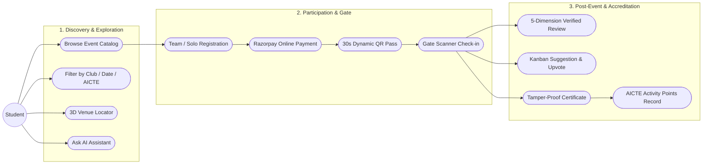
```mermaid
flowchart LR
    Student((Student))

    subgraph Discovery ["1. Discovery & Exploration"]
        Browse([Browse Event Catalog])
        Filter([Filter by Club / Date / AICTE])
        Tour3D([3D Venue Locator])
        AIChat([Ask AI Assistant])
    end

    subgraph Participation ["2. Participation & Gate"]
        Register([Team / Solo Registration])
        Pay([Razorpay Online Payment])
        Pass([30s Dynamic QR Pass])
        GateCheck([Gate Scanner Check-in])
    end

    subgraph PostEvent ["3. Post-Event & Accreditation"]
        Review([5-Dimension Verified Review])
        Suggest([Kanban Suggestion & Upvote])
        Cert([Tamper-Proof Certificate])
        Points([AICTE Activity Points Record])
    end

    Student --> Browse
    Student --> Filter
    Student --> Tour3D
    Student --> AIChat

    Browse --> Register
    Register --> Pay
    Pay --> Pass
    Pass --> GateCheck

    GateCheck --> Review
    GateCheck --> Suggest
    GateCheck --> Cert
    Cert --> Points
```

---

### 3.3 Club Admin Actor Flow

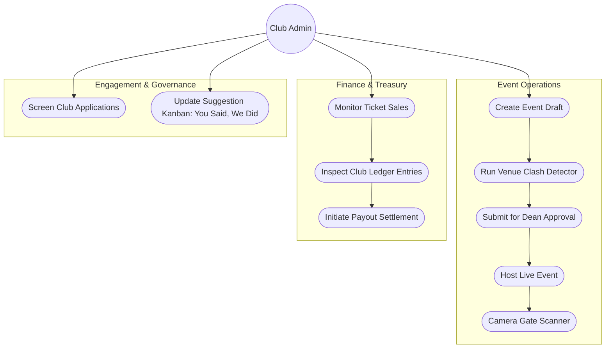
```mermaid
flowchart TD
    Admin((Club Admin))

    subgraph EventOps ["Event Operations"]
        Draft([Create Event Draft])
        Clash([Run Venue Clash Detector])
        Submit([Submit for Dean Approval])
        Live([Host Live Event])
        ScanQR([Camera Gate Scanner])
    end

    subgraph FinanceLedger ["Finance & Treasury"]
        ViewSales([Monitor Ticket Sales])
        Ledger([Inspect Club Ledger Entries])
        PayoutReq([Initiate Payout Settlement])
    end

    subgraph StudentGovernance ["Engagement & Governance"]
        ReviewApps([Screen Club Applications])
        KanbanAct([Update Suggestion Kanban: You Said, We Did])
    end

    Admin --> Draft
    Draft --> Clash
    Clash --> Submit
    Submit --> Live
    Live --> ScanQR

    Admin --> ViewSales
    ViewSales --> Ledger
    Ledger --> PayoutReq

    Admin --> ReviewApps
    Admin --> KanbanAct
```

---

### 3.4 Super Admin (Dean / Leadership) Flow

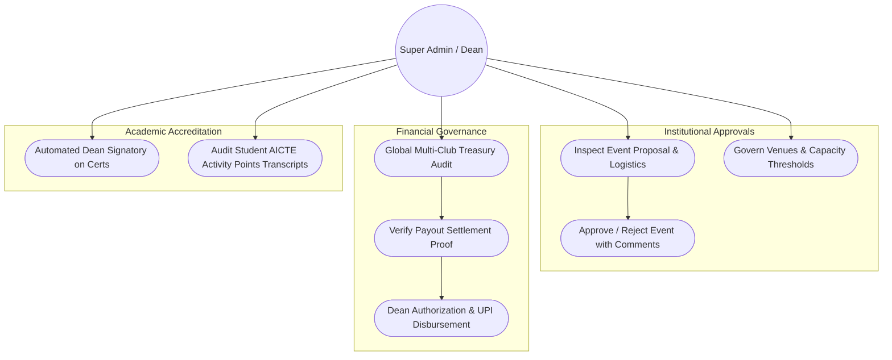
```mermaid
flowchart TD
    Dean((Super Admin / Dean))

    subgraph ApprovalOps ["Institutional Approvals"]
        InspectProp([Inspect Event Proposal & Logistics])
        ApproveEv([Approve / Reject Event with Comments])
        VenueGov([Govern Venues & Capacity Thresholds])
    end

    subgraph FinancialGovernance ["Financial Governance"]
        AuditLedgers([Global Multi-Club Treasury Audit])
        VerifyPayout([Verify Payout Settlement Proof])
        AuthorizeDisb([Dean Authorization & UPI Disbursement])
    end

    subgraph AcademicAccreditation ["Academic Accreditation"]
        SignCert([Automated Dean Signatory on Certs])
        AuditAICTE([Audit Student AICTE Activity Points Transcripts])
    end

    Dean --> InspectProp
    InspectProp --> ApproveEv
    Dean --> VenueGov

    Dean --> AuditLedgers
    AuditLedgers --> VerifyPayout
    VerifyPayout --> AuthorizeDisb

    Dean --> SignCert
    Dean --> AuditAICTE
```

---

## 4. UML Class Diagram

### 4.1 Backend Domain Model Hierarchy

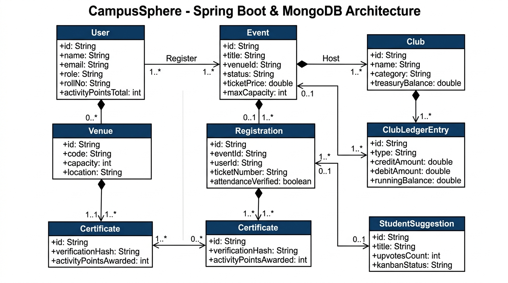

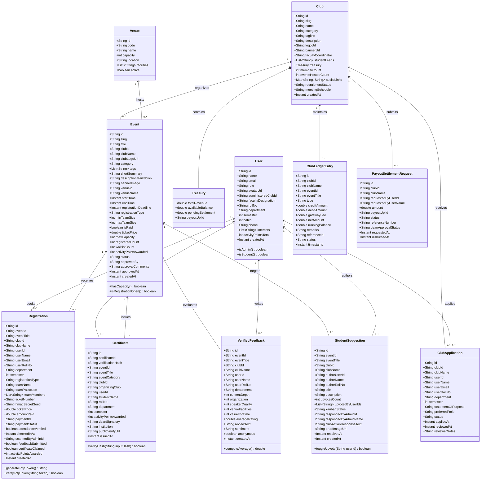
```mermaid
classDiagram
    class User {
        +String id
        +String name
        +String email
        +String role
        +String avatarUrl
        +String administeredClubId
        +String facultyDesignation
        +String rollNo
        +String department
        +int semester
        +int batch
        +String phone
        +List~String~ interests
        +int activityPointsTotal
        +Instant createdAt
        +isAdmin() boolean
        +isStudent() boolean
    }

    class Club {
        +String id
        +String slug
        +String name
        +String category
        +String tagline
        +String description
        +String logoUrl
        +String bannerUrl
        +String facultyCoordinator
        +List~String~ studentLeads
        +Treasury treasury
        +int memberCount
        +int eventsHostedCount
        +Map~String, String~ socialLinks
        +String recruitmentStatus
        +String meetingSchedule
        +Instant createdAt
    }

    class Treasury {
        +double totalRevenue
        +double availableBalance
        +double pendingSettlement
        +String payoutUpiId
    }

    class Venue {
        +String id
        +String code
        +String name
        +int capacity
        +String location
        +List~String~ facilities
        +boolean active
    }

    class Event {
        +String id
        +String slug
        +String title
        +String clubId
        +String clubName
        +String clubLogoUrl
        +String category
        +List~String~ tags
        +String shortSummary
        +String descriptionMarkdown
        +String bannerImage
        +String venueId
        +String venueName
        +Instant startTime
        +Instant endTime
        +Instant registrationDeadline
        +String registrationType
        +int minTeamSize
        +int maxTeamSize
        +boolean isPaid
        +double ticketPrice
        +int maxCapacity
        +int registeredCount
        +int waitlistCount
        +int activityPointsAwarded
        +String status
        +String approvedBy
        +String approvalComments
        +Instant approvedAt
        +Instant createdAt
        +hasCapacity() boolean
        +isRegistrationOpen() boolean
    }

    class Registration {
        +String id
        +String eventId
        +String eventTitle
        +String clubId
        +String clubName
        +String userId
        +String userName
        +String userEmail
        +String userRollNo
        +String department
        +int semester
        +String registrationType
        +String teamName
        +String teamPasscode
        +List~String~ teamMembers
        +String ticketNumber
        +String hmacSecretSeed
        +double ticketPrice
        +double amountPaid
        +String paymentId
        +String paymentStatus
        +boolean attendanceVerified
        +Instant checkedInAt
        +String scannedByAdminId
        +boolean feedbackSubmitted
        +boolean certificateClaimed
        +int activityPointsAwarded
        +Instant createdAt
        +generateTotpToken() String
        +verifyTotpToken(String token) boolean
    }

    class Certificate {
        +String id
        +String certificateId
        +String verificationHash
        +String eventId
        +String eventTitle
        +String eventCategory
        +String clubId
        +String organizingClub
        +String userId
        +String studentName
        +String rollNo
        +String department
        +int semester
        +int activityPointsAwarded
        +String deanSignatory
        +String institution
        +String publicVerifyUrl
        +Instant issuedAt
        +verifyHash(String inputHash) boolean
    }

    class ClubLedgerEntry {
        +String id
        +String clubId
        +String clubName
        +String eventId
        +String eventTitle
        +String type
        +double creditAmount
        +double debitAmount
        +double gatewayFee
        +double netAmount
        +double runningBalance
        +String remarks
        +String referenceId
        +String status
        +Instant timestamp
    }

    class PayoutSettlementRequest {
        +String id
        +String clubId
        +String clubName
        +String requestedByUserId
        +String requestedByUserName
        +double amount
        +String payoutUpiId
        +String status
        +String referenceNumber
        +String deanApprovalStatus
        +Instant requestedAt
        +Instant disbursedAt
    }

    class ClubApplication {
        +String id
        +String clubId
        +String clubName
        +String userId
        +String userName
        +String userEmail
        +String userRollNo
        +String department
        +int semester
        +String statementOfPurpose
        +String preferredRole
        +String status
        +Instant appliedAt
        +Instant reviewedAt
        +String reviewerNotes
    }

    class StudentSuggestion {
        +String id
        +String eventId
        +String eventTitle
        +String clubId
        +String clubName
        +String authorUserId
        +String authorName
        +String authorRollNo
        +String title
        +String description
        +int upvotesCount
        +List~String~ upvotedByUserIds
        +String kanbanStatus
        +String respondedByAdminId
        +String respondedByAdminName
        +String clubActionResponseText
        +String proofImageUrl
        +Instant resolvedAt
        +Instant createdAt
        +toggleUpvote(String userId) boolean
    }

    class VerifiedFeedback {
        +String id
        +String eventId
        +String eventTitle
        +String clubId
        +String clubName
        +String userId
        +String userName
        +String userRollNo
        +String department
        +int contentDepth
        +int organization
        +int speakerQuality
        +int venueFacilities
        +int valueForTime
        +double averageRating
        +String reviewText
        +String sentiment
        +boolean anonymous
        +Instant createdAt
        +computeAverage() double
    }

    %% Relationships
    Club *-- Treasury : contains
    Club "1" <-- "0..*" Event : organizes
    Venue "1" <-- "0..*" Event : hosts
    User "1" <-- "0..*" Registration : books
    Event "1" <-- "0..*" Registration : receives
    User "1" <-- "0..*" Certificate : earns
    Event "1" <-- "0..*" Certificate : issues
    Club "1" <-- "0..*" ClubLedgerEntry : maintains
    Club "1" <-- "0..*" PayoutSettlementRequest : submits
    Club "1" <-- "0..*" ClubApplication : receives
    User "1" <-- "0..*" ClubApplication : applies
    Event "1" <-- "0..*" VerifiedFeedback : evaluates
    User "1" <-- "0..*" VerifiedFeedback : writes
    Event "1" <-- "0..*" StudentSuggestion : targets
    User "1" <-- "0..*" StudentSuggestion : authors
```

---

### 4.2 Service & Controller Architecture

```mermaid
classDiagram
    class EventController {
        -EventService eventService
        +getLiveEvents() ResponseEntity
        +getEventBySlug(String slug) ResponseEntity
        +createEvent(EventProposalDto dto) ResponseEntity
        +updateEventStatus(String id, String status) ResponseEntity
    }

    class RegistrationController {
        -RegistrationService registrationService
        +registerForEvent(RegistrationRequestDto dto) ResponseEntity
        +getStudentTickets(String userId) ResponseEntity
        +verifyGateTicket(GateVerificationRequestDto dto) ResponseEntity
    }

    class VenueController {
        -VenueClashEngineService venueClashEngine
        +getAllVenues() ResponseEntity
        +checkClashes(VenueClashCheckDto dto) ResponseEntity
    }

    class CertificateController {
        -CertificateService certificateService
        +getStudentCertificates(String userId) ResponseEntity
        +verifyCertificate(String hash) ResponseEntity
        +getAicteTranscript(String userId) ResponseEntity
    }

    class FeedbackController {
        -FeedbackService feedbackService
        +submitFeedback(FeedbackSubmissionDto dto) ResponseEntity
        +getEventFeedbackSummary(String eventId) ResponseEntity
        +submitSuggestion(SuggestionSubmissionDto dto) ResponseEntity
        +updateKanbanStatus(KanbanStatusUpdateDto dto) ResponseEntity
    }

    class EventService {
        -EventRepository eventRepo
        -VenueRepository venueRepo
        -VenueClashEngineService clashEngine
        +createEvent(EventProposalDto dto) Event
        +approveEvent(String eventId, String deanId) Event
    }

    class RegistrationService {
        -RegistrationRepository regRepo
        -EventRepository eventRepo
        -ClubLedgerRepository ledgerRepo
        +createRegistration(RegistrationRequestDto dto) Registration
        +verifyGateCheckIn(String ticketNumber, String totp) GateResult
    }

    class VenueClashEngineService {
        -EventRepository eventRepo
        +detectClash(String venueId, Instant start, Instant end, int bufferMin) VenueClashResult
    }

    EventController --> EventService
    RegistrationController --> RegistrationService
    VenueController --> VenueClashEngineService
    FeedbackController --> FeedbackService
    CertificateController --> CertificateService
    EventService --> VenueClashEngineService
```

---

## 5. Entity Relationship Diagram (ERD)

### 5.1 Complete 11-Collection MongoDB Schema

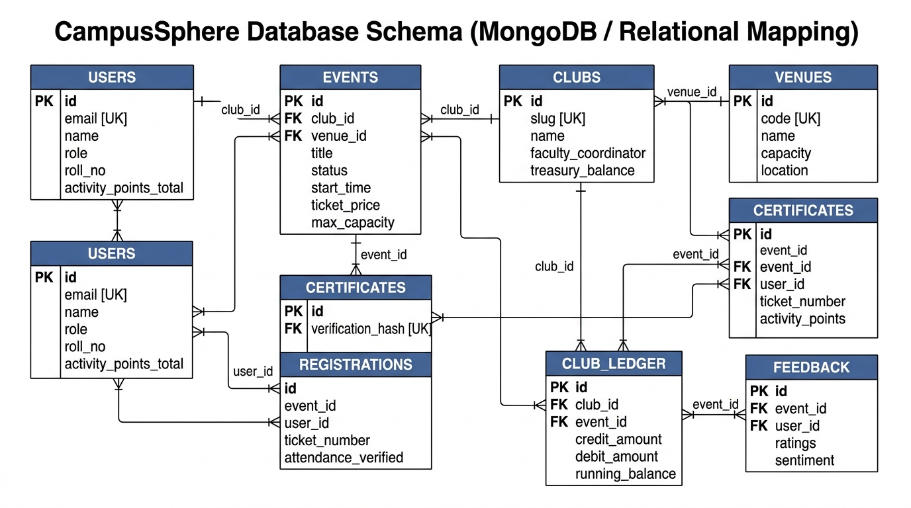

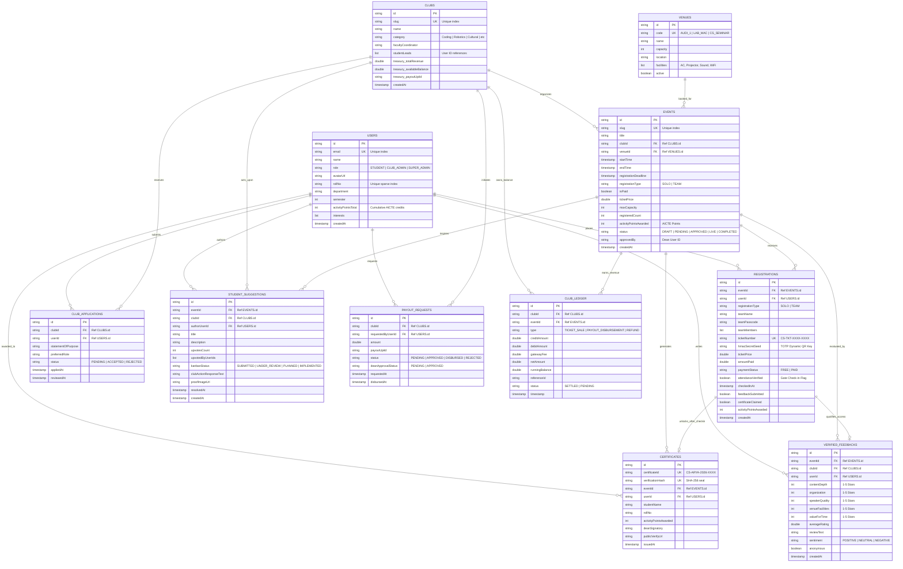
```mermaid
erDiagram
    USERS ||--o{ REGISTRATIONS : "places"
    USERS ||--o{ CERTIFICATES : "awarded_to"
    USERS ||--o{ CLUB_APPLICATIONS : "submits"
    USERS ||--o{ STUDENT_SUGGESTIONS : "authors"
    USERS ||--o{ VERIFIED_FEEDBACKS : "writes"
    USERS ||--o{ PAYOUT_REQUESTS : "requests"

    CLUBS ||--o{ EVENTS : "organizes"
    CLUBS ||--o{ CLUB_LEDGER : "owns_balance"
    CLUBS ||--o{ PAYOUT_REQUESTS : "initiates"
    CLUBS ||--o{ CLUB_APPLICATIONS : "receives"
    CLUBS ||--o{ STUDENT_SUGGESTIONS : "acts_upon"

    VENUES ||--o{ EVENTS : "booked_for"

    EVENTS ||--o{ REGISTRATIONS : "receives"
    EVENTS ||--o{ CERTIFICATES : "generates"
    EVENTS ||--o{ VERIFIED_FEEDBACKS : "evaluated_by"
    EVENTS ||--o{ STUDENT_SUGGESTIONS : "inspires"
    EVENTS ||--o{ CLUB_LEDGER : "earns_revenue"

    REGISTRATIONS ||--o| CERTIFICATES : "unlocks_after_checkin"
    REGISTRATIONS ||--o| VERIFIED_FEEDBACKS : "qualifies_access"

    USERS {
        string id PK
        string email UK "Unique index"
        string name
        string role "STUDENT | CLUB_ADMIN | SUPER_ADMIN"
        string avatarUrl
        string rollNo "Unique sparse index"
        string department
        int semester
        int activityPointsTotal "Cumulative AICTE credits"
        list interests
        timestamp createdAt
    }

    CLUBS {
        string id PK
        string slug UK "Unique index"
        string name
        string category "Coding | Robotics | Cultural | etc"
        string facultyCoordinator
        list studentLeads "User ID references"
        double treasury_totalRevenue
        double treasury_availableBalance
        string treasury_payoutUpiId
        timestamp createdAt
    }

    VENUES {
        string id PK
        string code UK "AUDI_1 | LAB_MAC | CS_SEMINAR"
        string name
        int capacity
        string location
        list facilities "AC, Projector, Sound, WiFi"
        boolean active
    }

    EVENTS {
        string id PK
        string slug UK "Unique index"
        string title
        string clubId FK "Ref CLUBS.id"
        string venueId FK "Ref VENUES.id"
        timestamp startTime
        timestamp endTime
        timestamp registrationDeadline
        string registrationType "SOLO | TEAM"
        boolean isPaid
        double ticketPrice
        int maxCapacity
        int registeredCount
        int activityPointsAwarded "AICTE Points"
        string status "DRAFT | PENDING | APPROVED | LIVE | COMPLETED"
        string approvedBy "Dean User ID"
        timestamp createdAt
    }

    REGISTRATIONS {
        string id PK
        string eventId FK "Ref EVENTS.id"
        string userId FK "Ref USERS.id"
        string registrationType "SOLO | TEAM"
        string teamName
        string teamPasscode
        list teamMembers
        string ticketNumber UK "CS-TKT-XXXX-XXXX"
        string hmacSecretSeed "TOTP Dynamic QR Key"
        double ticketPrice
        double amountPaid
        string paymentStatus "FREE | PAID"
        boolean attendanceVerified "Gate Check-in Flag"
        timestamp checkedInAt
        boolean feedbackSubmitted
        boolean certificateClaimed
        int activityPointsAwarded
        timestamp createdAt
    }

    CLUB_LEDGER {
        string id PK
        string clubId FK "Ref CLUBS.id"
        string eventId FK "Ref EVENTS.id"
        string type "TICKET_SALE | PAYOUT_DISBURSEMENT | REFUND"
        double creditAmount
        double debitAmount
        double gatewayFee
        double netAmount
        double runningBalance
        string referenceId
        string status "SETTLED | PENDING"
        timestamp timestamp
    }

    PAYOUT_REQUESTS {
        string id PK
        string clubId FK "Ref CLUBS.id"
        string requestedByUserId FK "Ref USERS.id"
        double amount
        string payoutUpiId
        string status "PENDING | APPROVED | DISBURSED | REJECTED"
        string deanApprovalStatus "PENDING | APPROVED"
        timestamp requestedAt
        timestamp disbursedAt
    }

    CLUB_APPLICATIONS {
        string id PK
        string clubId FK "Ref CLUBS.id"
        string userId FK "Ref USERS.id"
        string statementOfPurpose
        string preferredRole
        string status "PENDING | ACCEPTED | REJECTED"
        timestamp appliedAt
        timestamp reviewedAt
    }

    STUDENT_SUGGESTIONS {
        string id PK
        string eventId FK "Ref EVENTS.id"
        string clubId FK "Ref CLUBS.id"
        string authorUserId FK "Ref USERS.id"
        string title
        string description
        int upvotesCount
        list upvotedByUserIds
        string kanbanStatus "SUBMITTED | UNDER_REVIEW | PLANNED | IMPLEMENTED"
        string clubActionResponseText
        string proofImageUrl
        timestamp resolvedAt
        timestamp createdAt
    }

    VERIFIED_FEEDBACKS {
        string id PK
        string eventId FK "Ref EVENTS.id"
        string clubId FK "Ref CLUBS.id"
        string userId FK "Ref USERS.id"
        int contentDepth "1-5 Stars"
        int organization "1-5 Stars"
        int speakerQuality "1-5 Stars"
        int venueFacilities "1-5 Stars"
        int valueForTime "1-5 Stars"
        double averageRating
        string reviewText
        string sentiment "POSITIVE | NEUTRAL | NEGATIVE"
        boolean anonymous
        timestamp createdAt
    }

    CERTIFICATES {
        string id PK
        string certificateId UK "CS-ARYA-2026-XXXX"
        string verificationHash UK "SHA-256 seal"
        string eventId FK "Ref EVENTS.id"
        string userId FK "Ref USERS.id"
        string studentName
        string rollNo
        int activityPointsAwarded
        string deanSignatory
        string publicVerifyUrl
        timestamp issuedAt
    }
```

---

## 6. Behavioral & Sequence Diagrams

### 6.1 Event Creation & Super Admin Approval Flow

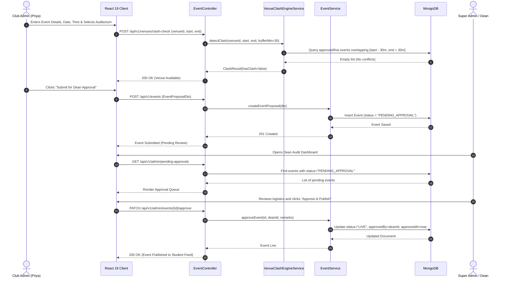
```mermaid
sequenceDiagram
    autonumber
    actor ClubLead as Club Admin (Priya)
    participant Client as React 19 Client
    participant EventCtrl as EventController
    participant ClashEngine as VenueClashEngineService
    participant EventSvc as EventService
    participant Mongo as MongoDB
    actor Dean as Super Admin / Dean

    ClubLead->>Client: Enters Event Details, Date, Time & Selects Auditorium
    Client->>EventCtrl: POST /api/v1/venues/clash-check (venueId, start, end)
    EventCtrl->>ClashEngine: detectClash(venueId, start, end, bufferMin=30)
    ClashEngine->>Mongo: Query approved/live events overlapping [start - 30m, end + 30m]
    Mongo-->>ClashEngine: Empty list (No conflicts)
    ClashEngine-->>EventCtrl: ClashResult(hasClash=false)
    EventCtrl-->>Client: 200 OK (Venue Available)

    ClubLead->>Client: Clicks "Submit for Dean Approval"
    Client->>EventCtrl: POST /api/v1/events (EventProposalDto)
    EventCtrl->>EventSvc: createEventProposal(dto)
    EventSvc->>Mongo: Insert Event (status = "PENDING_APPROVAL")
    Mongo-->>EventSvc: Event Saved
    EventSvc-->>EventCtrl: 201 Created
    EventCtrl-->>Client: Event Submitted (Pending Review)

    Dean->>Client: Opens Dean Audit Dashboard
    Client->>EventCtrl: GET /api/v1/admin/pending-approvals
    EventCtrl->>Mongo: Find events with status="PENDING_APPROVAL"
    Mongo-->>EventCtrl: List of pending events
    EventCtrl-->>Client: Render Approval Queue

    Dean->>Client: Reviews logistics and clicks "Approve & Publish"
    Client->>EventCtrl: PATCH /api/v1/admin/events/{id}/approve
    EventCtrl->>EventSvc: approveEvent(id, deanId, remarks)
    EventSvc->>Mongo: Update status="LIVE", approvedBy=deanId, approvedAt=now
    Mongo-->>EventSvc: Updated Document
    EventSvc-->>EventCtrl: Event Live
    EventCtrl-->>Client: 200 OK (Event Published to Student Feed)
```

---

### 6.2 Registration, Team Invite & Payment Settlement Flow

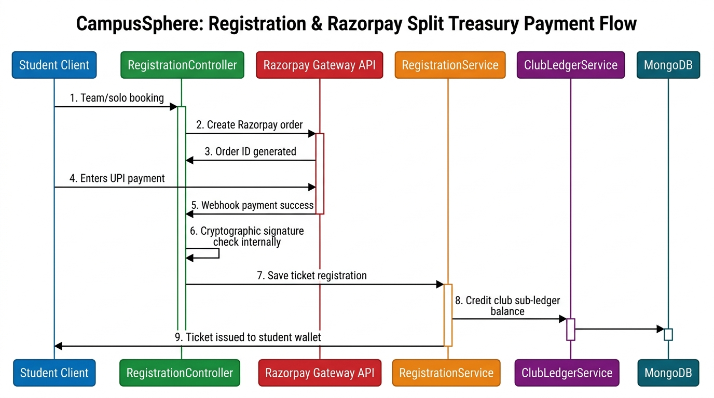

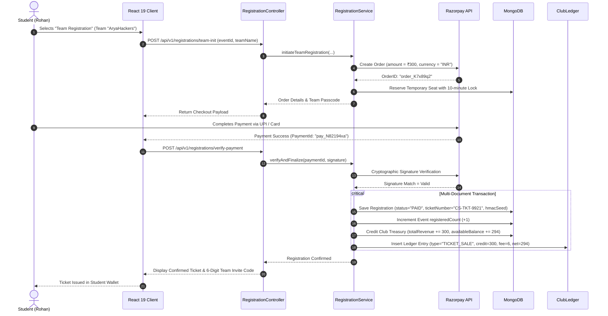
```mermaid
sequenceDiagram
    autonumber
    actor Student as Student (Rohan)
    participant Client as React 19 Client
    participant RegCtrl as RegistrationController
    participant RegSvc as RegistrationService
    participant Razorpay as Razorpay API
    participant Mongo as MongoDB
    participant Ledger as ClubLedger

    Student->>Client: Selects "Team Registration" (Team "AryaHackers")
    Client->>RegCtrl: POST /api/v1/registrations/team-init (eventId, teamName)
    RegCtrl->>RegSvc: initiateTeamRegistration(...)
    RegSvc->>Razorpay: Create Order (amount = ₹300, currency = "INR")
    Razorpay-->>RegSvc: OrderID: "order_K7x89q2"
    RegSvc->>Mongo: Reserve Temporary Seat with 10-minute Lock
    RegSvc-->>RegCtrl: Order Details & Team Passcode
    RegCtrl-->>Client: Return Checkout Payload

    Student->>Razorpay: Completes Payment via UPI / Card
    Razorpay-->>Client: Payment Success (PaymentId: "pay_N82194xa")
    Client->>RegCtrl: POST /api/v1/registrations/verify-payment
    RegCtrl->>RegSvc: verifyAndFinalize(paymentId, signature)
    RegSvc->>Razorpay: Cryptographic Signature Verification
    Razorpay-->>RegSvc: Signature Match = Valid

    critical Multi-Document Transaction
        RegSvc->>Mongo: Save Registration (status="PAID", ticketNumber="CS-TKT-9921", hmacSeed)
        RegSvc->>Mongo: Increment Event registeredCount (+1)
        RegSvc->>Mongo: Credit Club Treasury (totalRevenue += 300, availableBalance += 294)
        RegSvc->>Ledger: Insert Ledger Entry (type="TICKET_SALE", credit=300, fee=6, net=294)
    end

    RegSvc-->>RegCtrl: Registration Confirmed
    RegCtrl-->>Client: Display Confirmed Ticket & 6-Digit Team Invite Code
    Client-->>Student: Ticket Issued in Student Wallet
```

---

### 6.3 30-Second Rolling HMAC Dynamic QR Gate Verification

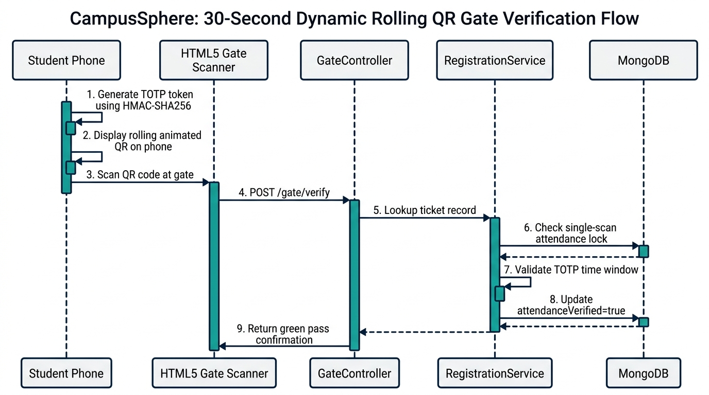

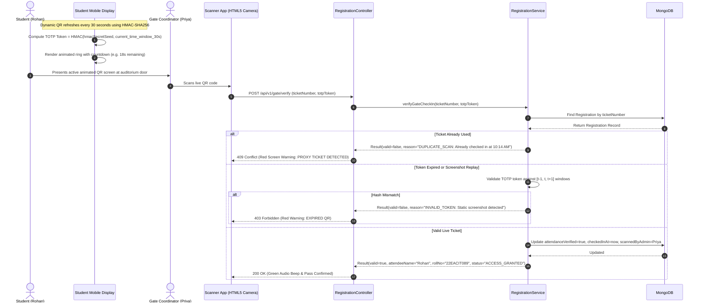
```mermaid
sequenceDiagram
    autonumber
    actor Student as Student (Rohan)
    participant Phone as Student Mobile Display
    actor Scanner as Gate Coordinator (Priya)
    participant Cam as Scanner App (HTML5 Camera)
    participant RegCtrl as RegistrationController
    participant RegSvc as RegistrationService
    participant Mongo as MongoDB

    Note over Phone: Dynamic QR refreshes every 30 seconds using HMAC-SHA256
    Phone->>Phone: Compute TOTP Token = HMAC(hmacSecretSeed, current_time_window_30s)
    Phone->>Phone: Render animated ring with countdown (e.g. 18s remaining)
    
    Student->>Scanner: Presents active animated QR screen at auditorium door
    Scanner->>Cam: Scans live QR code
    Cam->>RegCtrl: POST /api/v1/gate/verify (ticketNumber, totpToken)
    RegCtrl->>RegSvc: verifyGateCheckIn(ticketNumber, totpToken)

    RegSvc->>Mongo: Find Registration by ticketNumber
    Mongo-->>RegSvc: Return Registration Record

    alt Ticket Already Used
        RegSvc-->>RegCtrl: Result(valid=false, reason="DUPLICATE_SCAN: Already checked in at 10:14 AM")
        RegCtrl-->>Cam: 409 Conflict (Red Screen Warning: PROXY TICKET DETECTED)
    else Token Expired or Screenshot Replay
        RegSvc->>RegSvc: Validate TOTP token against [t-1, t, t+1] windows
        alt Hash Mismatch
            RegSvc-->>RegCtrl: Result(valid=false, reason="INVALID_TOKEN: Static screenshot detected")
            RegCtrl-->>Cam: 403 Forbidden (Red Warning: EXPIRED QR)
        end
    else Valid Live Ticket
        RegSvc->>Mongo: Update attendanceVerified=true, checkedInAt=now, scannedByAdmin=Priya
        Mongo-->>RegSvc: Updated
        RegSvc-->>RegCtrl: Result(valid=true, attendeeName="Rohan", rollNo="22EACIT089", status="ACCESS_GRANTED")
        RegCtrl-->>Cam: 200 OK (Green Audio Beep & Pass Confirmed)
    end
```

---

### 6.4 Attendance-Gated Feedback & AICTE Certificate Issuance

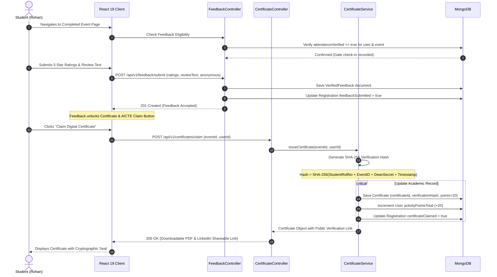
```mermaid
sequenceDiagram
    autonumber
    actor Student as Student (Rohan)
    participant Client as React 19 Client
    participant FeedCtrl as FeedbackController
    participant CertCtrl as CertificateController
    participant CertSvc as CertificateService
    participant Mongo as MongoDB

    Student->>Client: Navigates to Completed Event Page
    Client->>FeedCtrl: Check Feedback Eligibility
    FeedCtrl->>Mongo: Verify attendanceVerified == true for user & event
    Mongo-->>FeedCtrl: Confirmed (Gate check-in recorded)

    Student->>Client: Submits 5-Star Ratings & Review Text
    Client->>FeedCtrl: POST /api/v1/feedback/submit (ratings, reviewText, anonymous)
    FeedCtrl->>Mongo: Save VerifiedFeedback document
    FeedCtrl->>Mongo: Update Registration feedbackSubmitted = true
    FeedCtrl-->>Client: 201 Created (Feedback Accepted)

    Note over Client: Feedback unlocks Certificate & AICTE Claim Button
    Student->>Client: Clicks "Claim Digital Certificate"
    Client->>CertCtrl: POST /api/v1/certificates/claim (eventId, userId)
    CertCtrl->>CertSvc: issueCertificate(eventId, userId)

    CertSvc->>CertSvc: Generate SHA-256 Verification Hash
    Note over CertSvc: Hash = SHA-256(StudentRollNo + EventID + DeanSecret + Timestamp)

    critical Update Academic Record
        CertSvc->>Mongo: Save Certificate (certificateId, verificationHash, points=20)
        CertSvc->>Mongo: Increment User activityPointsTotal (+20)
        CertSvc->>Mongo: Update Registration certificateClaimed = true
    end

    CertSvc-->>CertCtrl: Certificate Object with Public Verification Link
    CertCtrl-->>Client: 200 OK (Downloadable PDF & LinkedIn Shareable Link)
    Client-->>Student: Displays Certificate with Cryptographic Seal
```

---

### 6.5 Venue Clash Detection & Buffer Resolution

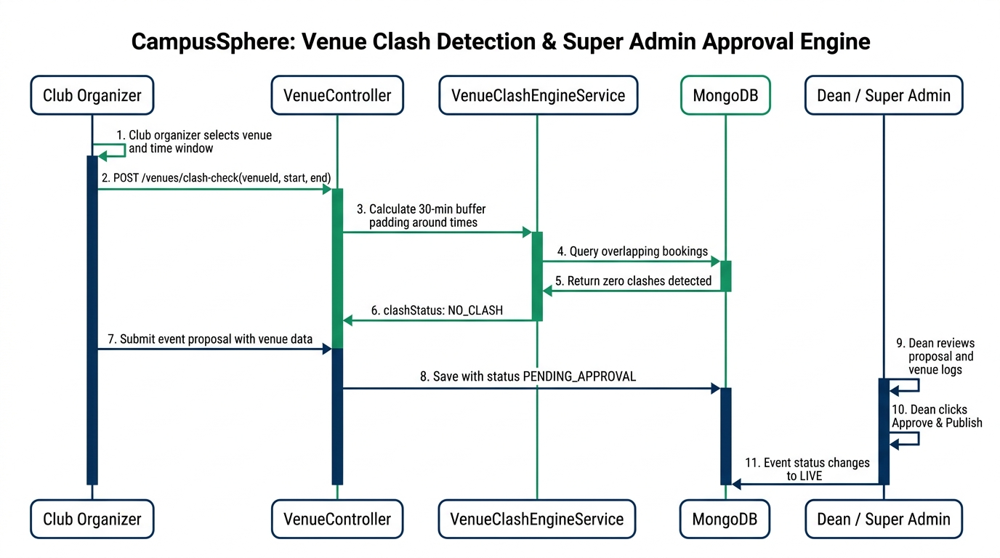

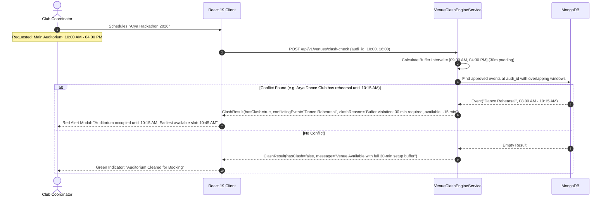
```mermaid
sequenceDiagram
    autonumber
    actor Admin as Club Coordinator
    participant Client as React 19 Client
    participant VenueSvc as VenueClashEngineService
    participant Mongo as MongoDB

    Admin->>Client: Schedules "Arya Hackathon 2026"
    Note over Admin: Requested: Main Auditorium, 10:00 AM - 04:00 PM
    Client->>VenueSvc: POST /api/v1/venues/clash-check (audi_id, 10:00, 16:00)

    VenueSvc->>VenueSvc: Calculate Buffer Interval = [09:30 AM, 04:30 PM] (30m padding)
    VenueSvc->>Mongo: Find approved events at audi_id with overlapping windows

    alt Conflict Found (e.g. Arya Dance Club has rehearsal until 10:15 AM)
        Mongo-->>VenueSvc: Event("Dance Rehearsal", 08:00 AM - 10:15 AM)
        VenueSvc-->>Client: ClashResult(hasClash=true, conflictingEvent="Dance Rehearsal", clashReason="Buffer violation: 30 min required, available: -15 min")
        Client-->>Admin: Red Alert Modal: "Auditorium occupied until 10:15 AM. Earliest available slot: 10:45 AM"
    else No Conflict
        Mongo-->>VenueSvc: Empty Result
        VenueSvc-->>Client: ClashResult(hasClash=false, message="Venue Available with full 30-min setup buffer")
        Client-->>Admin: Green Indicator: "Auditorium Cleared for Booking"
    end
```

---

## 7. State Machine Diagrams

### 7.1 Event Lifecycle State Machine

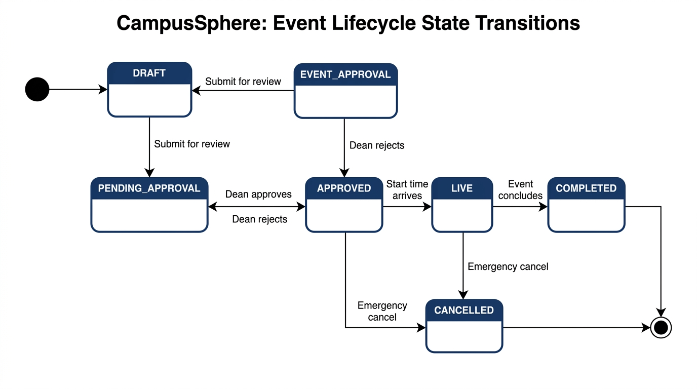

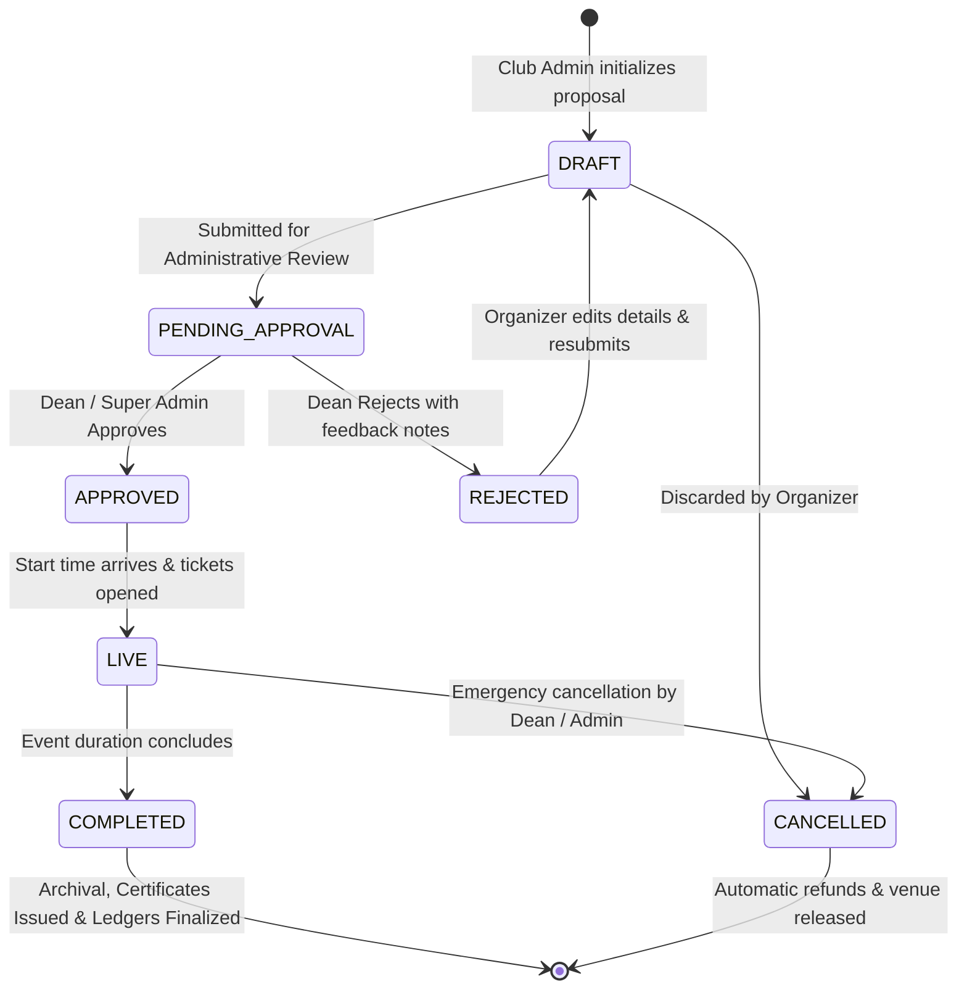
```mermaid
stateDiagram-v2
    [*] --> DRAFT : Club Admin initializes proposal

    DRAFT --> PENDING_APPROVAL : Submitted for Administrative Review
    DRAFT --> CANCELLED : Discarded by Organizer

    PENDING_APPROVAL --> APPROVED : Dean / Super Admin Approves
    PENDING_APPROVAL --> REJECTED : Dean Rejects with feedback notes

    REJECTED --> DRAFT : Organizer edits details & resubmits

    APPROVED --> LIVE : Start time arrives & tickets opened
    LIVE --> COMPLETED : Event duration concludes
    LIVE --> CANCELLED : Emergency cancellation by Dean / Admin

    COMPLETED --> [*] : Archival, Certificates Issued & Ledgers Finalized
    CANCELLED --> [*] : Automatic refunds & venue released
```

---

### 7.2 Registration & Attendance Lifecycle

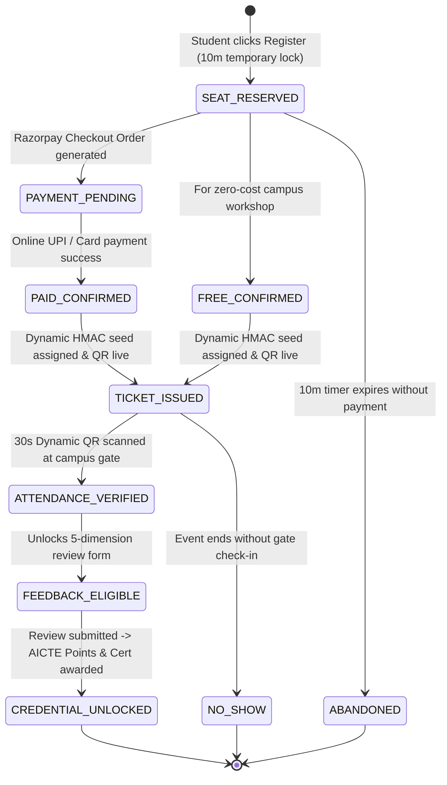
```mermaid
stateDiagram-v2
    [*] --> SEAT_RESERVED : Student clicks Register (10m temporary lock)

    SEAT_RESERVED --> PAYMENT_PENDING : Razorpay Checkout Order generated
    SEAT_RESERVED --> ABANDONED : 10m timer expires without payment

    PAYMENT_PENDING --> PAID_CONFIRMED : Online UPI / Card payment success
    SEAT_RESERVED --> FREE_CONFIRMED : For zero-cost campus workshop

    PAID_CONFIRMED --> TICKET_ISSUED : Dynamic HMAC seed assigned & QR live
    FREE_CONFIRMED --> TICKET_ISSUED : Dynamic HMAC seed assigned & QR live

    TICKET_ISSUED --> ATTENDANCE_VERIFIED : 30s Dynamic QR scanned at campus gate
    TICKET_ISSUED --> NO_SHOW : Event ends without gate check-in

    ATTENDANCE_VERIFIED --> FEEDBACK_ELIGIBLE : Unlocks 5-dimension review form
    FEEDBACK_ELIGIBLE --> CREDENTIAL_UNLOCKED : Review submitted -> AICTE Points & Cert awarded

    CREDENTIAL_UNLOCKED --> [*]
    NO_SHOW --> [*]
    ABANDONED --> [*]
```

---

### 7.3 "You Said, We Did" Kanban Workflow

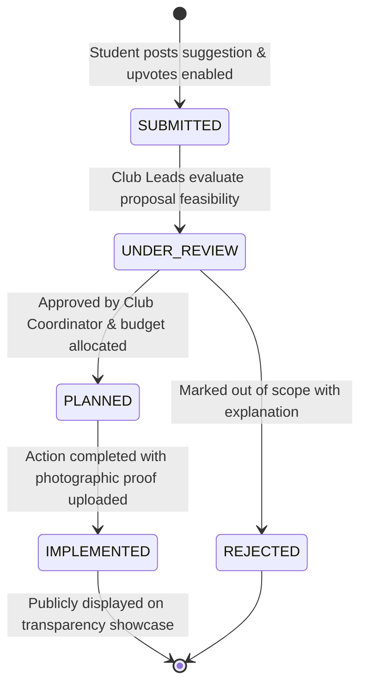
```mermaid
stateDiagram-v2
    [*] --> SUBMITTED : Student posts suggestion & upvotes enabled

    SUBMITTED --> UNDER_REVIEW : Club Leads evaluate proposal feasibility
    UNDER_REVIEW --> PLANNED : Approved by Club Coordinator & budget allocated
    UNDER_REVIEW --> REJECTED : Marked out of scope with explanation

    PLANNED --> IMPLEMENTED : Action completed with photographic proof uploaded
    IMPLEMENTED --> [*] : Publicly displayed on transparency showcase
    REJECTED --> [*]
```

### 7.4 UML Activity Diagram (Student Event Lifecycle)

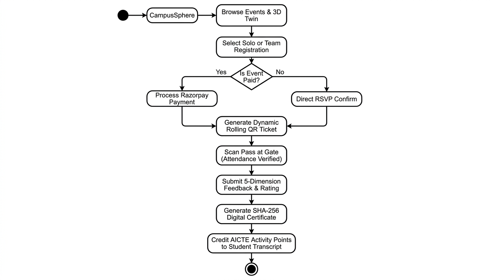

---

## 8. Data Flow Diagrams (DFD)

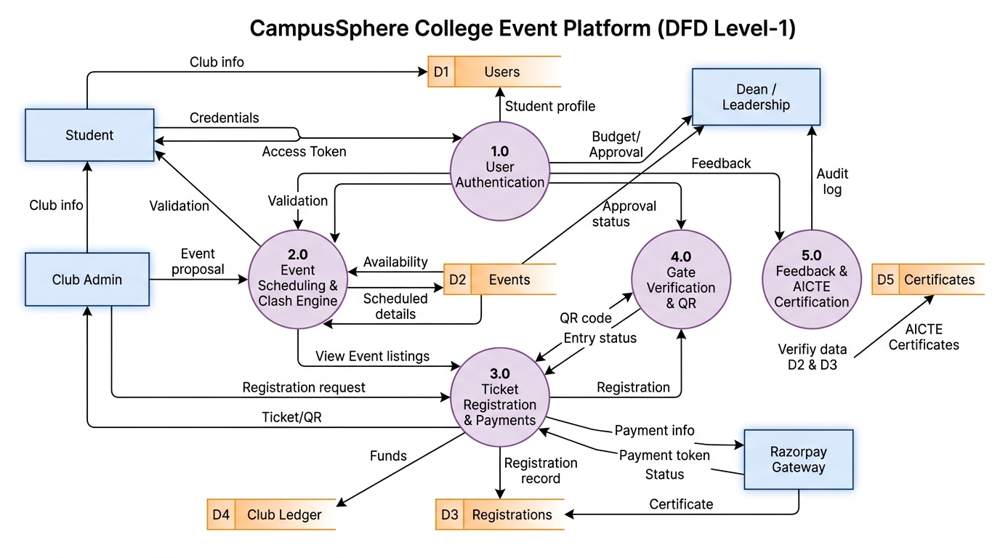

### Level 0 Context Diagram (System Boundary)

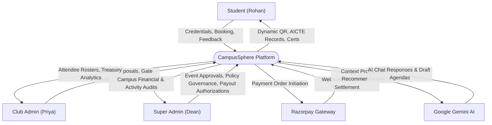
```mermaid
flowchart TD
    Student["Student (Rohan)"]
    Admin["Club Admin (Priya)"]
    Dean["Super Admin (Dean)"]
    System(["CampusSphere Platform"])
    Razorpay["Razorpay Gateway"]
    Gemini["Google Gemini AI"]

    Student -->|Credentials, Booking, Feedback| System
    System -->|Dynamic QR, AICTE Records, Certs| Student

    Admin -->|Event Proposals, Gate Scans, Payout Requests| System
    System -->|Attendee Rosters, Treasury Analytics| Admin

    Dean -->|Event Approvals, Policy Governance, Payout Authorizations| System
    System -->|Campus Financial & Activity Audits| Dean

    System -->|Payment Order Initiation| Razorpay
    Razorpay -->|Webhook & Payment Settlement| System

    System -->|Context Prompts & Recommendations| Gemini
    Gemini -->|AI Chat Responses & Draft Agendas| System
```

---

## 9. UML Deployment Architecture Diagram

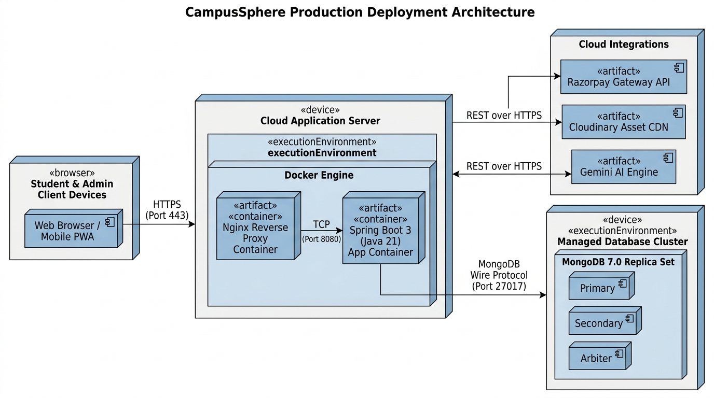

---

## Document Control & Verification Notice

* **Document Version:** 1.0.0-PROD
* **Repository Path:** `docs/SYSTEM_DESIGN_AND_UML.md`
* **Local Git Status:** Saved locally in workspace. **Not pushed to remote GitHub repository** as explicitly specified.
* **Target Audience:** Engineering Faculty, Project Review Panel, Student Coordinators, System Developers.
